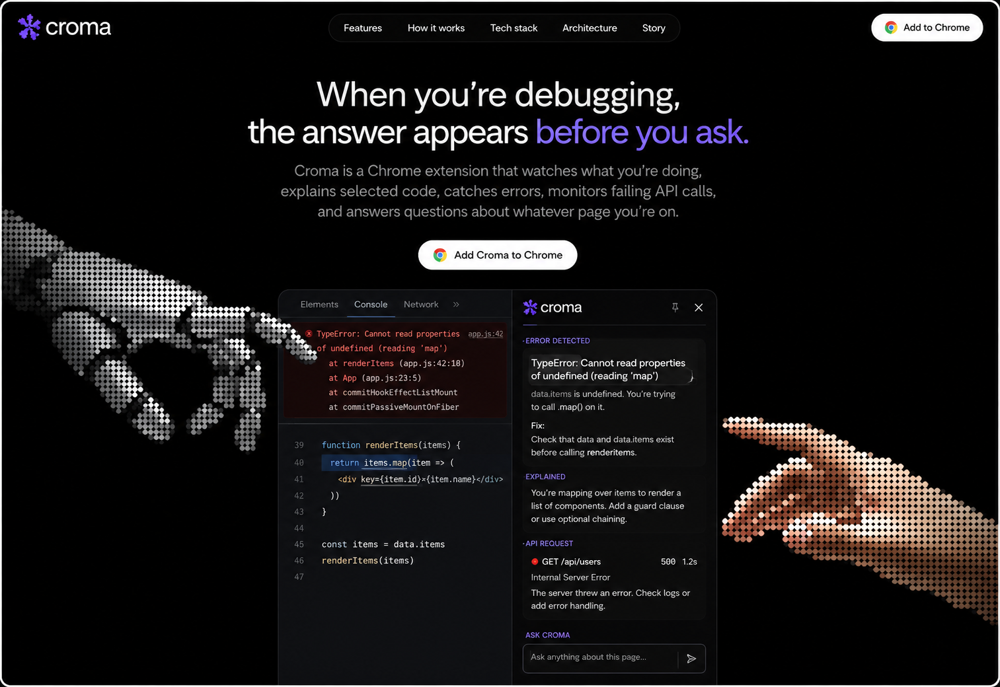

<div align="center">



# Croma

---

*AI dev tools inside your browser*

A Chrome extension that watches what you're doing — explains selected code, catches console errors, monitors failing API calls, and answers questions about whatever page you're on. Without leaving your tab.


</div>

---

## About The Project

Croma is a Chrome extension built for developers who are tired of alt-tabbing to ChatGPT to explain stack traces they're already staring at.

It runs silently in the background and surfaces AI-powered answers the moment you need them — before you've consciously decided to ask.

**What it does automatically:**

- **Select any code or text** → sidebar explains it instantly
- **Console errors on localhost** → caught and diagnosed before you've even seen them
- **Failing or slow API calls** → flagged with the reason and a fix
- **Ask anything about the page** → manual Q&A in the footer input

---

## Project Preview

<div align="center">

| DevTools panel with error | Croma sidebar explaining it |
|---|---|
| TypeError caught automatically | Root cause + fix in the sidebar |

</div>

```
┌─────────────────────────────────┬──────────────────────────────┐
│  Elements  Console  Network     │  ✳ croma              📌  ✕  │
├─────────────────────────────────┤──────────────────────────────│
│  ✕ TypeError: Cannot read       │  · ERROR DETECTED            │
│    properties of undefined      │ ┌────────────────────────┐   │
│    (reading 'map')  app.js:42   │ │ TypeError: Cannot read │   │
│                                 │ │ properties (reading    │   │
│  39  function renderItems() {   │ │ 'map')                 │   │
│  40►   return items.map(item => │ │                        │   │
│  41      <div key={item.id}>    │ │ data.items is          │   │
│  42    ))                       │ │ undefined.             │   │
│  43  }                          │ └────────────────────────┘   │
│                                 │  Fix: guard before .map()    │
│  45  const items = data.items   ├──────────────────────────────│
│  46  renderItems(items)         │  · API REQUEST               │
│                                 │  ● GET /api/users  500  1.2s │
│                                 ├──────────────────────────────│
│                                 │  Ask anything about this...  │
└─────────────────────────────────┴──────────────────────────────┘
```

---

## Features

| Feature | Description |
|---|---|
| ⌗ **Code explain** | Select any code — the sidebar explains what it does, returns, and what to watch out for |
| ⚠ **Error monitor** | Console errors, runtime exceptions, and unhandled rejections auto-diagnosed on localhost |
| ↗ **Network inspector** | 4xx/5xx calls and requests over 1.5s flagged with explanation and fix |
| ✦ **Page Q&A** | Ask anything about any page — docs, GitHub, error pages, any site |
| ⇄ **Anthropic + OpenAI** | Your own API key. Stored once in Chrome sync. Never enter it again |
| ◫ **Shadow DOM isolated** | Sidebar lives in Shadow DOM — zero conflict with host page styles |

---

## Tech Stack

```
UI Framework    →  Preact          (React-compatible, ~3kb)
Build Tool      →  Vite + CRXJS   (HMR for extensions)
Isolation       →  Shadow DOM      (no CSS bleed from host page)
API Streaming   →  Raw fetch + SSE (no SDK, works in service workers)
Storage         →  chrome.storage.sync
Language        →  TypeScript
Manifest        →  MV3
AI Providers    →  Anthropic Claude + OpenAI GPT-4o
```

---

## Architecture

```
┌─────────────────────────────────────────────────────┐
│            Content Script (content.tsx)             │
│                                                     │
│  selectionchange  →  console.error patch            │
│  window.fetch wrapper  →  unhandledrejection        │
│                                                     │
│         Shadow DOM sidebar (Preact)                 │
└──────────────────┬──────────────────────────────────┘
                   │  chrome.runtime.sendMessage
                   ▼
┌─────────────────────────────────────────────────────┐
│           Service Worker (service-worker.ts)        │
│                                                     │
│  chrome.storage.sync  →  fetch API (SSE stream)     │
│  Anthropic / OpenAI   →  CHUNK messages             │
└──────────────────┬──────────────────────────────────┘
                   │  chrome.tabs.sendMessage
                   ▼
           Content Script receives
           chunks → sidebar renders live
```

---

## Getting Started

### Prerequisites

- Node.js 18+
- An [Anthropic](https://console.anthropic.com) or [OpenAI](https://platform.openai.com/api-keys) API key

### Installation

```bash
# Clone the repo
git clone https://github.com/Arishsingh/croma
cd croma

# Install dependencies
npm install

# Build the extension
npm run build
```

### Load in Chrome

1. Open `chrome://extensions`
2. Enable **Developer mode** (top right toggle)
3. Click **Load unpacked**
4. Select the `dist/` folder
5. Click the Croma icon in your toolbar
6. Paste your API key → Save

Done. Select any code on any page.

---

## Usage

| Action | What happens |
|---|---|
| Select 30+ chars of code | Sidebar opens and explains it |
| Select 60+ chars of text | Sidebar explains it in plain language |
| Console error on localhost | Auto-diagnosed without you doing anything |
| API call fails (4xx/5xx) | Sidebar shows why and how to fix |
| API call takes > 1.5s | Sidebar explains the slowness |
| Type in footer input | Ask anything about the current page |

---

## Project Structure

```
croma/
├── src/
│   ├── background/
│   │   └── service-worker.ts    # API streaming, storage, message hub
│   ├── content/
│   │   ├── content.tsx          # Selection, error, fetch monitoring
│   │   └── SidebarApp.tsx       # Sidebar UI (Shadow DOM, Preact)
│   ├── popup/
│   │   ├── App.tsx              # API key management UI
│   │   └── popup.html
│   ├── devtools/
│   │   └── panel.tsx            # DevTools panel (network + console)
│   └── types.ts                 # Shared types + system prompts
├── scripts/
│   └── postbuild.mjs            # Patches CRXJS loader
├── landing/
│   └── index.html               # Landing page
├── manifest.json
└── vite.config.ts
```

---

## How Streaming Works

No SDK. Raw SSE parser in the service worker:

```typescript
buffer += decoder.decode(value, { stream: true })
const lines = buffer.split('\n')
buffer = lines.pop() ?? ''          // keep incomplete last line

for (const line of lines) {
  if (!line.startsWith('data: ')) continue
  const event = JSON.parse(line.slice(6))
  const text = extractText(event)
  if (text) chrome.tabs.sendMessage(tabId, { type: 'CHUNK', text })
}
```

Same function handles both Anthropic and OpenAI via a swappable `extractText` callback.

---

## Contributing

PRs are welcome. For major changes, open an issue first.

```bash
npm run dev      # development build with HMR
npm run build    # production build → dist/
```

---

read detailed stuff on :- https://dev.to/arishsingh99/built-a-chrome-extension-that-watches-my-dev-tab-and-explains-everything-3mob

